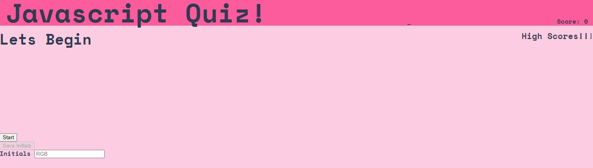
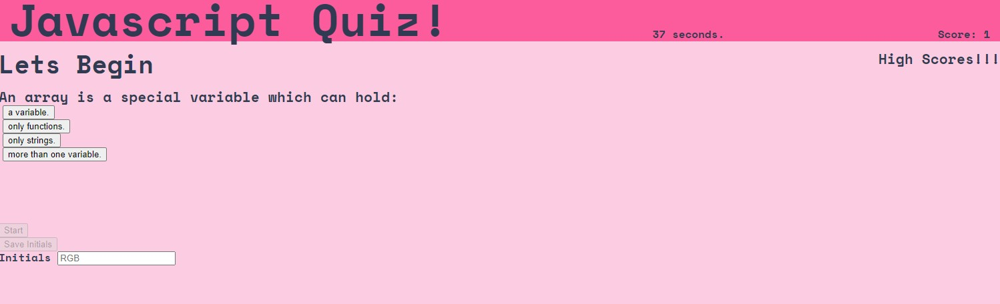
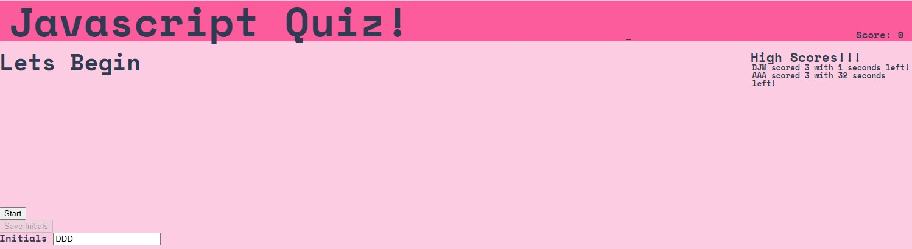

# Coding_Quiz
Timed JavaScript quiz made in HTML/CSS/JS

## Notes
A coding quiz for Java Script.  The quiz runs through 10 basic JavaScript questions, and ends when either the questions run out or the timer runs out.  Incorrect answers deduct additional time.  A score from 0 to 10 is possible.  Upon completion, the quiz-taker can enter their intitals which are then stored to local storage.  The app will also retrieve any stored high scores and render them in the browser.

## Deployed Site

[Deployed](https://danielmrva.github.io/Coding_Quiz/)

## Github

[Github](https://github.com/DanielMrva/Coding_Quiz)

